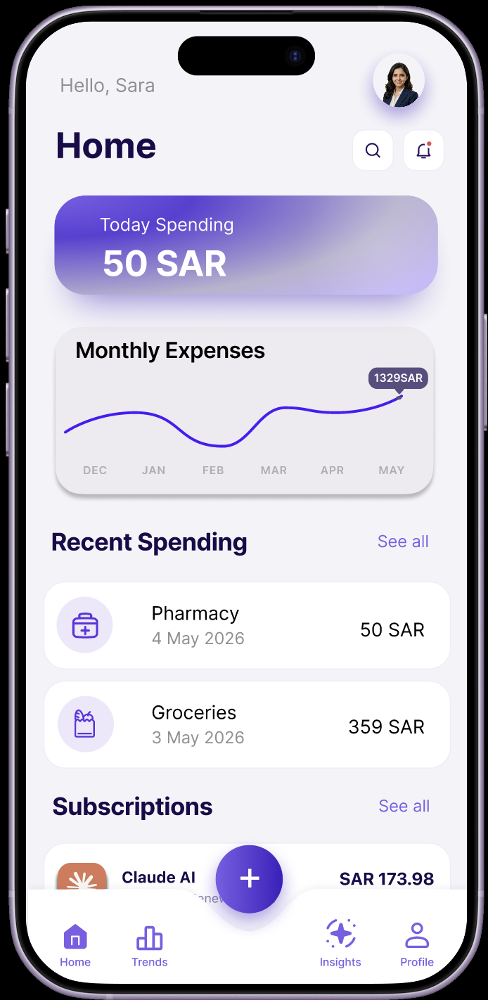
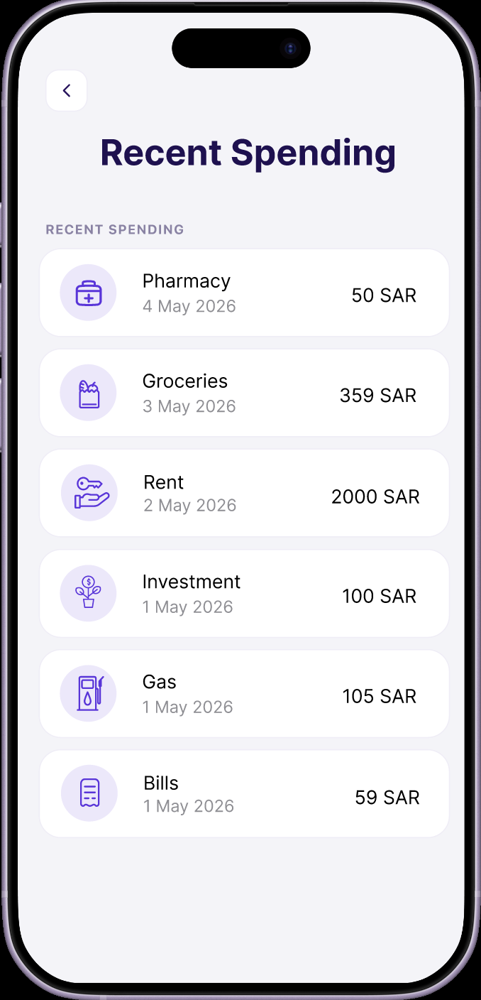
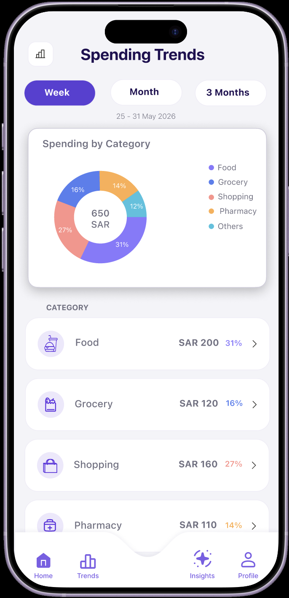
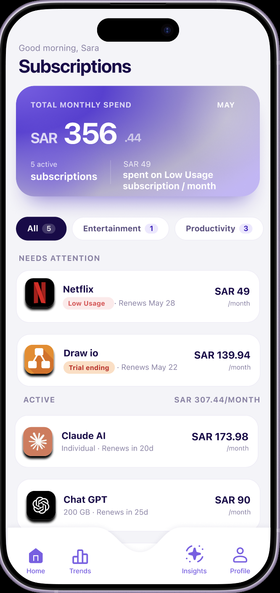
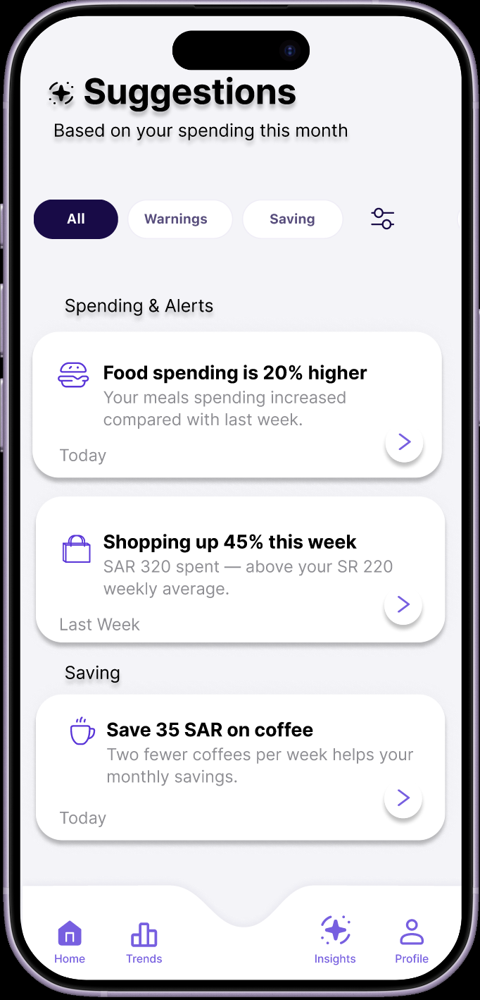

# THMN 💜
### Personal Finance Mobile Application

THMN is a UX/UI mobile application prototype designed to help users better understand and manage their personal finances through a simple and supportive digital experience.

The application brings expense tracking, spending analysis, subscription management, and personalized financial suggestions into one interface.

> 🏆 **2nd Place — CS Project Fair (Human-Computer Interaction Course)**

## Overview

Managing personal finances often requires users to keep track of expenses, recurring subscriptions, and spending patterns across different places.

THMN was designed to bring these activities together in a single mobile experience, allowing users to monitor their spending, understand financial patterns, manage subscriptions, and receive useful financial suggestions.

## Core Features

### 💳 Expense Tracking

Users can add expenses and review their recent spending history with clear categories, dates, and transaction amounts.

### 📊 Spending Trends

THMN provides visual spending analysis that allows users to:

- View spending by category
- Filter spending by week, month, or three months
- Review category-level expenses
- Understand changes in spending patterns

### 🔄 Subscription Management

The application provides a dedicated area for reviewing and managing active subscriptions.

Users can view subscription details, identify subscriptions that may need attention, review recurring payments, and manage their plans.

### ✨ Personalized Financial Suggestions

THMN provides financial suggestions based on users' spending behavior.

Suggestions can highlight spending changes, provide alerts, and recommend opportunities to reduce expenses and improve saving habits.

## Design Process

The project followed a user-centered design process that included:

1. User research
2. Requirements analysis
3. Persona development
4. Task and interaction flow design
5. Wireframing
6. High-fidelity prototyping
7. Usability testing
8. Design improvements

## Functional Requirements

The prototype was designed around several key functional requirements, including:

- Viewing recent spending history
- Adding expenses
- Viewing spending trends through charts
- Filtering spending by different time periods
- Viewing expenses by category
- Receiving personalized financial suggestions
- Reviewing active subscriptions
- Viewing subscription usage and payment information
- Managing or cancelling subscriptions
- Receiving feedback after important actions

## Usability Testing

The THMN prototype was evaluated with **four participants** representing the application's target users.

Participants completed four core tasks:

| Task | Purpose |
|---|---|
| Add Expense | Evaluate the expense-entry process |
| Spending Trends | Evaluate spending analysis and visualization |
| Suggestions | Evaluate personalized financial recommendations |
| Subscription | Evaluate subscription management |

All participants successfully completed the main tasks, and no critical usability problems were identified.

Testing also revealed several areas for improvement, including the visibility of some actions, clarity of subscription terminology, and navigation behavior.

## Design Improvements

Feedback from usability testing was used to refine the prototype.

One identified issue involved onboarding navigation. Some participants naturally attempted to swipe between onboarding screens instead of using the **Next** button.

To better match common mobile interaction patterns, drag/swipe interaction was added alongside tap navigation.

Other feedback helped improve the clarity and discoverability of interface elements related to subscriptions and financial suggestions.

## Prototype

The final solution was developed as a **high-fidelity interactive mobile prototype using Figma**.

The prototype demonstrates the application's primary user flows and financial management features, including expense tracking, spending visualization, personalized suggestions, and subscription management.

## Tools & Methods

- Figma
- UX/UI Design
- User Research
- Personas
- User Flows
- Wireframing
- High-Fidelity Prototyping
- Cognitive Walkthrough
- Usability Testing

## Project Type

Human-Computer Interaction Project  
Computer Science  
King Saud University  
2026

🏆 **Awarded 2nd Place at the CS Project Fair — Human-Computer Interaction Course**

## About This Repository

This repository serves as a portfolio showcase of the THMN project.

Selected final interface designs and project information are provided to demonstrate the application's concept, UX/UI design process, core functionality, and usability evaluation.
